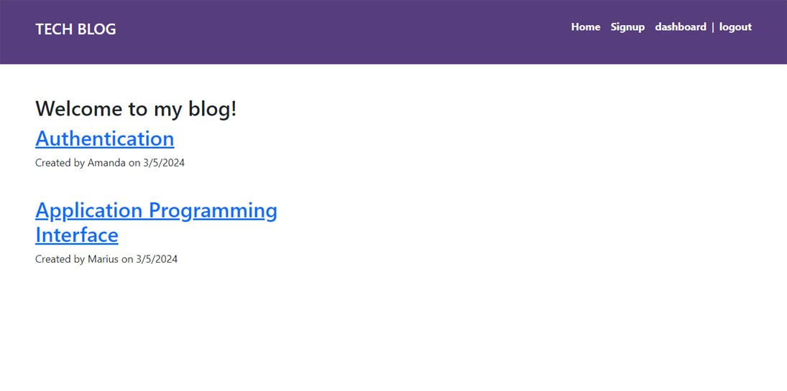

# Tech Blog app

## Description

This project challenged me to use the MVC (Model-View-Controller) structure to create an app.

During this project I learned how to use:

- sequelize to connect to mysql database.
- mysql database for persistence.
- create a login system with sessions.
- Run CRUD operations on the database.
- handlebars to display html content.
- the dotenv package to secure important information.
- bcrypt to hash a password.
- models in creating database tables.

## Link to web app

https://marius-blog-b90344ce9071.herokuapp.com

## Installation (N/A)

## Usage

This app provides an easy and accessible interface for developers
to discuss technical concepts and new technologies.

## Screenshot of website

## Credits: Resources used

I used and modified code from the following resources:

https://sequelize.org/docs/v6/getting-started/

https://www.youtube.com/watch?v=erfN7fH7A6s&list=PLurIMwd6GdCi3ssXNAcjZ2l5mYaTfYPhf

https://www.youtube.com/watch?v=YNyGD4rakmc&list=PLkqiWyX-_Lov8qmMOVn4SEQwr9yOjNn3f

## License

MIT
